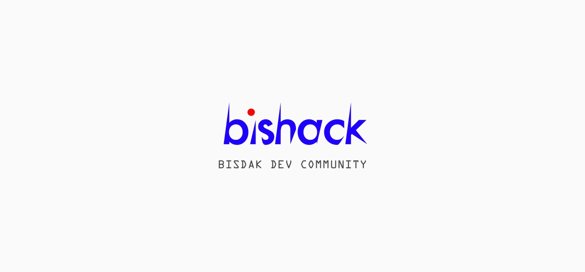

&nbsp;

&nbsp;

### Folder Structure
	.
	├── assets
	│   ├── css
	│   ├── dynamo       // dynamo schemas
	│   ├── scripts
	│   └── templates
	│
	├── handler
	├── middleware
	├── public
	│   └── images
	│
	├── services
	│   ├── dynamo
	│   ├── like
	│   ├── post
	│   └── user
	│
	├── testing
	│
	└── utils
	    └── session
&nbsp;

### Foreword

This application heavily relies on managed external services like: Cognito, DynamoDB, Lambda et cetera. So setting up a local development environment for this project needs a bit of an extra work.

If you want to contribute to this project, do **[let me know](https://github.com/penzur)** so I can assist you on setting up credentials and what not.

&nbsp;

### Prerequisites

- [**Go**](https://golang.org) - 1.12 or higher

- [**Docker**](https://docker.io)

- **AWS buffet** - you can always sign up for a free tier

	- **IAM Key Pair** - to be loaded into your `~/.aws/credentials` config file.

		> On mac you can actually just `$ brew install aws-cli` and then run `$ aws config` from your terminal. The prompt will ask you to input the credentials and will load them to the file I mentioned above.

	- **Cognito User Pool (with client key and secret)** - you can create one from AWS console.

		> Ping me on slack if you need help on this one.

	- **DynamoDB Tables** - [See DynamoDB Setup](#dynamodb-setup-local)

- **Github oauth credentials** this one is easy
- **Slack token** (optional)

&nbsp;

### Dev Setup

1. **To setup dev environment, just run the following command in your terminal window:**

	**`$ make setup`**

2. **Then create a `.env` file with the following content:**

		SLACK_TOKEN=<slack api token (optional)>
		SESSION_KEY=<32-bytes-key>
		CSRF_KEY=<32-bytes-key>
		COGNITO_CLIENT_ID=<ask @penzur>
		COGNITO_CLIENT_SECRET=<ask @penzur>
		GITHUB_CLIENT_ID=<ask @penzur>
		GITHUB_CLIENT_SECRET=<ask @penzur>
		GITHUB_CALLBACK=http://localhost:3000/signup
		DYNAMO_TABLE_POSTS=posts
		DYNAMO_TABLE_LIKES=likes
		DYNAMO_ENDPOINT=http://localhost:8000
		AWS_ACCESS_KEY_ID=<ask @penzur>
		AWS_SECRET_ACCESS_KEY=<ask @penzur>

3. **Go to `http://localhost:8000/shell` and copy, paste and run every files inside the `./assets/dynamo` folder.**

	> See example below:

	

4. **Once ☝🏼 is done, run the dev server with:**

	**`$ make dev`**

	> This will launch the hot-reload server.

&nbsp;

Happy Hacking! 🖖 🤓

&nbsp;

