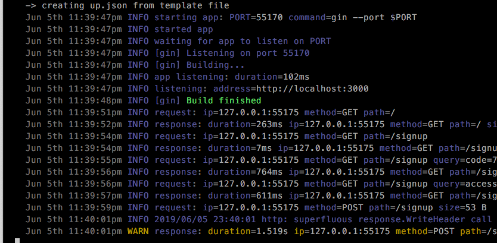

### bishack.dev 🦄 🚀

Dev Portal

&nbsp;

#### PREREQ
- a posix based workstation (mac, linux, etc...)
- a bitchin' text editor
- and a sense of humour

#### TECH STACK

- **`Go`** with gorilla.
- **`Vanilla JS `** for now. And hopefully move everything to `Svelte`
- **`[A][W][S]`** Free tier goodness! Kay walay budget 🙊

	- **`AWS Cognito`** for user identity and sync service
	- **`Apex/Up`** for serverless deployments and shit
	- **`Github Oauth`**

#### DEV SETUP

**You need the following before you can move forward:**

- AWS credentials
- Github oauth credentials

> Ask me on slack if you need help about getting these credentials

**Lez  get started!**

Download and install tools and dependencies using the following command from your terminal window:

	$ make dev.setup

> The above command will try to insta

And then run:

	$ COGNITO_CLIENT_ID=<key> \
	COGNITO_CLIENT_SECRET=<secret> \
	GITHUB_CLIENT_ID=<id> \
	GITHUB_CLIENT_SECRET=<secret> \
	GITHUB_CALLBACK=http://localhost:3000/signup \
	make dev

Should see something like this...

Head to `http://localhost:3000/` on your browser.

&nbsp;

Happy Hacking!
